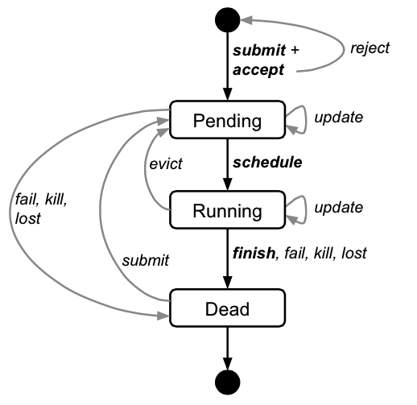

Reference：

1. [Large-scale cluster management at Google with Borg](http://static.googleusercontent.com/media/research.google.com/zh-CN/pubs/archive/43438.pdf)
2. [Borg-为程序员服务](http://ju.outofmemory.cn/entry/181767)
3. [译：Google的大规模集群管理工具Borg](https://www.cnblogs.com/YaoDD/p/5351589.html)

Borg是一个集群管理系统，确认，调度，启动，重启以及监视Google运行的所有应用。

## 特性

### Workload

Borg将运行其上的服务(workload)分为两类：
1.prod：在线任务，长期运行、对延时敏感、面向终端用户等，比如Gmail，Google Docs， Web Search服务等。
2.non-prod：离线任务，也称为批处理任务(batch)，比如一些分布式计算服务等。

### Cell

Cell是一个逻辑上的概念，它是一系列服务器的集合。一个Cell上跑一个集群管理系统Borg。其实在Cell的概念之上还有一个Cluster的概念，一个Cluster可以有一个或多个Cell(规模、用途各异)，并且归属于一个IDC。Cell的规模有大有小，一个中等规模的Cell大约含有1w台服务器。一般来说，Cell中的服务器都是异构的，它们可能有着不同的规格(CPU, RAM, disk, network)、处理器类型，有着性能和容量上的差异等。

通过定义Cell可以让Borg对服务器资源进行统一抽象，作为用户就无需知道自己的应用跑在哪台机器上，也不用关心资源分配、程序安装、依赖管理、健康检查及故障恢复等。

### Job和Task

用户以Job的形式提交应用部署请求。一个Job包含一个或者多个相同的Task，每个Task运行相同的一份应用程序，Task数量就是应用的副本数。Job也是逻辑上的概念，Task才是Borg系统的可调度单元。每个Task可以对应到Linux上的一组进程，这组进程运行在LXC容器里。
Google解释了采用容器技术的原因：
1. 硬件虚拟化成本太高；
2. Borg开始研发那会儿，虚拟化技术并不成熟。

每个Job可以定义一些属性、元信息和优先级，优先级涉及到抢占式调度过程。Borg对Job的定义了如下4个优先级：monitoring, production, batch, and best effort(test)，其中monitoring和production属于prod workload，batch和test属于non-prod workload。高优先级可以抢占低优先级，相同优先级的Job之间不能互相抢占，另外，prod workload的Job不能被抢占，也就是说，能被抢占的只有低优先级的batch和test任务。

以下是Job和Task的生命周期状态图：
 

从状态图中可见，无论是pending状态还是running状态的任务，Borg都支持它们动态更新，实时生效，这依赖于描述Job和Task所采用的BCL语言(GCL的一个变种)特性，具体原理和实现不明。

### Naming

Borg的服务发现通过BNS(Borg name service)来实现。Task调度和部署完毕后，Borg把Task的主机名和端口号写入Chubby(解决分布式环境下一致性问题的文件系统)，服务调用方通过RPC系统去自动发现服务。举例说明一个Task在服务发现配置中心的命名规则：
50.jfoo.ubar.cc.borg.google.com可表示在一个名为cc的Cell中由用户ubar部署的一个名为jfoo的Job下的第50个Task。

有了服务发现，即使Task下线、被抢占、故障恢复等情况出现，整个服务仍然可用的，当然服务前提是多副本的。

### Scalability

扩展性从三个方面的设计上说明：

1). Borgmaster主进程有5个副本，一主四从。每个副本都在内存中维护一份整个集群的状态，另外，集群状态也会被持久化到一个分布式的高可用Paxos存储系统上。在Cell初始化或者主节点挂掉的情况下，存活的副本会进行Paxos选举，选举新的主节点。主节点会在Chubby(提供了分布式的锁服务)获得一把锁来标记自己的主节点身份。所有能涉及改变集群状态的操作都由主节点完成，比如用户提交Job、结束Task执行或者机器下线之类的操作，主节点可读可写，从节点只读。主节点选举和failover的过程大概会持续10秒，在一些大规格Cell中可能会需要1分钟。

2). scheduler进程也是多副本运行的设计，一主多从。副本个数没有说明，应该没有限制。scheduler进程做的事情是状态无关的，从节点定期从主节点上获取当前集群的状态变更部分(含已分配和待调度任务之类的信息)，合并到本地的集群状态副本中，然后根据已有信息对任务进行调度计算，计算完毕将调度结果通知主节点，由主节点来决定是否进行调度。比如主节点发现scheduler副本本地缓存的集群状态已经过时，那么计算出来的调度结果也是无效的，那么就不会采纳。也就是说，scheduler从节点只计算，不进行实际调度。

3). Borgmaster采用轮询的方式定期从Borglet获取该节点的状态。之所以采用&quot;拉&quot;模型，而不是Borglet的&quot;推&quot;模型，Google的考虑是：在Borg管理的集群规模上，采用&quot;推&quot;模型将很难进行流量控制，但是&quot;拉&quot;模型可以通过动态改变轮询周期来进行控制，另外，在&quot;推&quot;模型中，当Borgmaster从故障中恢复时，会瞬间产生流量风暴。采用&quot;推&quot;还是&quot;拉&quot;模型，可能更多的是由Borgmaster本身是否带状态来决定的。Borg采用的是带状态的master设计(区分主从)，因此如果Borglet采用了&quot;推&quot;模型，当产生上述的流量风暴时便不可控，如果Borgmaster是无状态的，那么通过一些负载均衡技术就很容易化解所谓的recovery storms，便无需考虑流量控制。此外，每个Borgmaster从节点都有自己负责轮询和通信的固定数量的Borglet，这是通过进程内部的link shard模块实现的，Borglet每次都会上报自己的全量数据，Borgmaster从节点收到全量数据后，与自己本地缓存的集群状态进行比对，如果发现该Borglet有状态变化，则把状态变化的增量部分汇报给Borgmaster主节点，由其进行最终的集群状态变更操作，经过从节点对数据的预处理后，主节点能少处理很多信息。

### Availability

高可用性设计分为两个方面：

1) 应用高可用

被抢占的non-prod任务放回pending queue，等待重新调度。
多副本应用跨故障域部署。所谓故障域有大有小，比如相同机器、相同机架或相同电源插座等，一挂全挂。
对于类似服务器或操作系统升级的维护操作，避免大量服务器同时进行。
支持幂等性，支持客户端重复操作。
当服务器状态变为不可用时，要控制重新调度任务的速率。因为Borg无法区分是节点故障还是出现了短暂的网络分区，如果是后者，静静地等待网络恢复更利于保障服务可用性。
当某种&quot;任务@服务器&quot;的组合出现故障时，下次重新调度时需避免这种组合再次出现，因为极大可能会再次出现相同故障。
记录详细的内部信息，便于故障排查和分析。

保障应用高可用的关键性设计原则是：无论何种原因，即使Borgmaster或者Borglet挂掉、失联，都不能杀掉正在运行的服务(Task)。

2) Borg系统高可用

实践中，Borgmaster的可用性达到了4个9(99.99%)。

Borgmaster组件多副本设计。
采用一些简单的和底层(low-level)的工具来部署Borg系统实例，避免引入过多的外部依赖。
每个Cell的Borg均独立部署，避免不同Borg系统相互影响。

### Utilization

要提升资源利用率，&quot;混部&quot;是一个很好的解决思路，Borg采用的也是这样的思路，通过将在线任务(prod)和离线任务(non-prod, batch)混合部署，空闲时，离线任务可以充分利用计算资源，繁忙时，在线任务通过抢占的方式保证优先得到执行，合理地利用资源。这背后需要一个很完备的调度算法做支撑。Borg论文中并没有过多涉及相关的技术，只能从一些数据中了解Borg带来的收益：

98%的服务器实现了混部。
90%的服务器中跑了超过25个Task和4500个线程。
在一个中等规模的Cell里，在线任务和离线任务独立部署比混合部署所需的服务器数量多出约20%-30%。可以简单算一笔账，Google的服务器数量在千万级别，按20%算也是百万级别，大概能省下的服务器采购费用就是百亿级别了，这还不包括省下的机房等基础设施和电费等费用。

### Isolation

隔离性从两方面讨论：

安全性隔离：采用chroot jail实现。Borg时代还没有namespace技术，chroot可以认为是一个简略版的mnt namespace。
性能隔离：采用基于cgroup的容器技术实现。前文已经提到，Borg将任务类型分成在线和离线两种，在线任务(prod)是延时敏感(latency-sensitive)型的，优先级高，而离线任务(non-prod，batch)优先级低，Borg通过不同优先级之间的抢占式调度来优先保障在线任务的性能，牺牲离线任务。另一方面，Borg将资源类型也分成两类，可压榨的(compressible)和不可压榨的(non-compressible)。compressible类型的资源比如CPU、磁盘IO带宽，当这类资源成为瓶颈时，Borg不会Kill掉相应的任务。non-compressible类型的资源比如内存、磁盘空间，当这类资源成为瓶颈时，Borg会Kill掉相应的任务。

## 架构

Borg的整体架构分成两部分：Borgmaster和Borglet。整体架构如下：

 

### Borgmaster
Borgmaster是整个Borg系统逻辑上的中心节点，它又分成两个部分，Borgmaster主进程和scheduler调度进程。职责划分如下：

#### Borgmaster主进程：
处理客户端RPC请求，比如创建Job，查询Job等。
维护系统组件和服务的状态，比如服务器、Task等。
负责与Borglet通信。

#### scheduler进程：

用户提交Job后，Borgmaster主进程将Job信息持久化到Paxos存储池中，并且将其Task丢到一个Pending队列里。由scheduler进程定期轮询Pending队列，对Task进行调度执行。调度策略为：从高到低，相同优先级采用round-robin策略。

调度过程分为两阶段：

阶段一: feasibility checking，初步的调度可行性分析，确定一批符合调度要求的服务器。
阶段二: scoring，根据一些算法对阶段一中筛选出的服务器进行打分，选出最适合调度的一台机器。scoring过程可考虑的因素较多，比如可以考虑怎么调度才能使被抢占的低优先级任务数量最少，考虑目标服务器已经存在目标任务的包，考虑目标任务的跨域(power and failure domain)部署，考虑在目标机器上进行高低优先级任务的混合部署。

Borg前后经历了三种scoring模型：
1) E-PVM: 对多维度的资源类型降维，最终得到一个一维的数值。这是一种&quot;worst fit&quot;模型，各服务器负载尽量平均，好处是能够容忍应用的峰值，但是会增加资源碎片，导致大型应用找不到合适服务器部署。
2) &quot;best fit&quot;: 与第一类&quot;worst fit&quot;模型相反，它会尽量利用服务器资源，优先将已分配服务器资源跑满。这种模型的好处是不会产生很多资源碎片，坏处是要求应用申请时的配额一定要准确，否则可能被kill掉。另外这种模型对存在峰值的应用类型容忍能力有限。
3) hybrid: 它综合了&quot;worst fit&quot;和&quot;best fit&quot;，Borg目前采用的是这种模型，它的优势在于避免产生无法利用的资源碎片。所谓资源碎片，是指服务器某类资源耗尽，但是其他类型资源充足。比如说内存已经分配完，但是CPU使用率仍旧很低，那么这部分CPU资源是无法被利用的，就产生了CPU碎片。

可见从理论上看Borg的调度算法很完善，但是过于完善却不利于实际应用，因为每次调度都会涉及大量计算。Google从实用型角度做了一些优化：

1) Score caching: 对一次完整计算过后结果进行缓存，当服务器或者任务的状态未发生变更或者变更很少时，直接采用缓存数据，避免重复计算。
2) Equivalence classes: 因为一个Job下的所有Task都是等价的，所以可以采用等价类的思路，无需为Job中每个Task进行feasibility checking和scoring，调度多个相同的Task只需计算一次。
3) Relaxed randomization: 引入一些随机性，即每次随机选择一些机器，只要符合需求的服务器数量达到一定值时，就可以停止计算，无需每次对Cell中所有服务器进行feasibility checking。

### Borglet

Borglet是一个本地的Borg代理，它会出现在cell中的每一台机器上。它启动，停止task；在task失败的时候重启它们，通过控制操作系统内核设置来管理本地资源以及向Borgmaster和其他监视系统报告机器状态。

Borgmaster每过几分钟就轮询每个Borglet获取机器的当前状态，同时向它们发送外部的请求。这能够让Borgmaster控制交互的速率，避免了显示的流量控制和恢复风暴。

被选中的master用于准备发送给Borglet的信息以及利用Borglet的反馈更新cell的状态。为了性能的扩展性，每个Borgmaster重复单元都运行了一个link shard，用来处理和一些Borglet的交互；通常在Borgmaster的选举到来的时候，分区会被重新计算。为了弹性，Borglet通常会汇报它的全部状态，但是link shard会汇聚并且压缩这些信息，只汇报各个状态机的改变，从而降低选中的master的更新负载。

如果一个Borglet接连没有回复好几条轮询信息，那么相应的机器就被标志为down，并且它上面运行的任何task都将被重新调度到其他机器上。假如交互又恢复了，那么Borgmaster就会告诉对应的Borglet杀死那些已经被重新调度的task，从而避免重复。当Borglet失去了与Borgmaster的联系的时候，它依旧继续执行正常的操作，所以即使在所有的Borgmaster重复单元都挂掉之后，正在运行状态的task和服务依旧保持正常运行。

## 优点

1. 它隐藏了资源管理以及错误处理，因此用户能集中精力开发应用。
2. 具有非常高的可靠性和可用性，从而能够支持具有这些特性的应用。
3. 能够让我们跨越数以千计的机器有效地运行负载。
4. 应用接入和使用方便。提供了完备的Job描述语言，服务发现，实时状态监控和诊断工具。

## 不足

1. Job和Task之间的关系过于耦合，不能灵活指定Task。k8s中引入label机制，可以通过label指定任何Task(k8s中称为Pod)集合。
2. 部署在同一台服务器上的Task共享一个IP，通过端口号区分彼此。这使得所有Task共享服务器上的端口空间，使得端口本身也成为一种竞争资源，成为调度的一个考虑因素。k8s中每个Pod独享IP和该IP上的整个端口空间。
3. Borg系统中存在一些特权用户，使用法变得复杂。

## 个人见解

高效的集群管理可以说是互联网企业的核心技术。Google目前可以算是世界互联网企业的领头羊，其集群管理技术和经验也是我们所需要学习的。事实上之后的Omega和Kubernetes中也沿用了Borg中的一些技术和理论，因此对于borg的研究是十分必要的，只是碍于本人水平所限，更进一步的内容暂时没有进行深究。

说起来百度作为国内的互联网巨头同时也算是Google的同行，他的Matrix据说也达到了差不多的效果。可见其实百度至少在技术上还是在日益精进的，希望在保持技术进步的同时能在其他方面也好好考量下吧。
