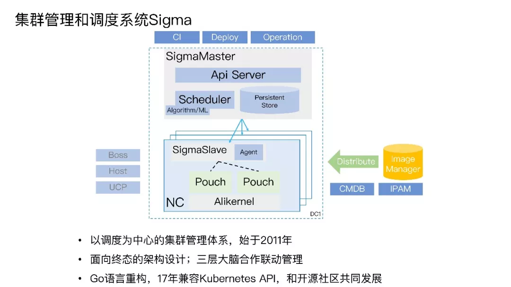
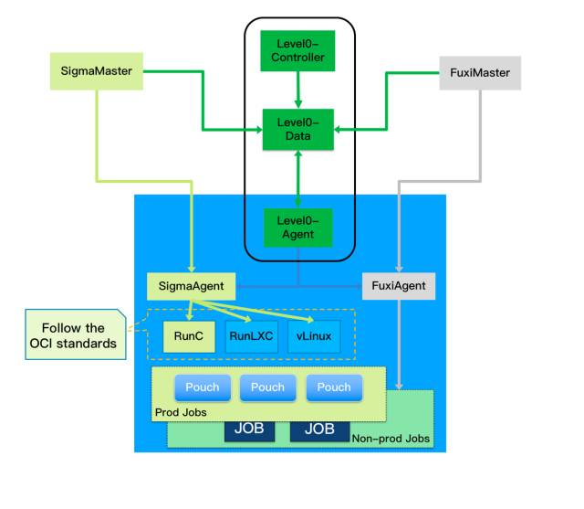

# Sigma
汪喆昊 516030910460

参考、引用了文章
- [史无前例开放！阿里内部集群管理系统Sigma混布数据](https://mp.weixin.qq.com/s/4-7LLacEksMGfw6eZPz53w?spm=a2c4e.11153940.blogcont196244.12.3838394feYN7Gh)
- [阿里巴巴 Sigma 调度和集群管理系统架构详解](https://juejin.im/post/5ad867b06fb9a045fc665ca4)

Sigma是阿里巴巴推出的开源集群管理系统，用于服务器资源的自动化管理、调度。

## 特点
### 统一调度体系
Sigma 有3层架，分别是Alikernel、SigmaSlave、SigmaMaster。
#### Alikernel
Alikernel 部署在每台物理机上，用于
>对内核进行增强，在资源分配、时间片分配上进行灵活的按优先级和策略调整，对任务的时延，任务时间片的抢占、不合理抢占的驱逐都能通过上层的规则配置自行决策。

简而言之是增强版的内核。
#### SigmaSlave
SigmaSlave 也部署在物理机上，用于
>在本机进行容器 CPU 分配、应急场景处理等。通过本机 Slave 对时延敏感任务的干扰快速做出决策和响应，避免因全局决策处理时间长带来的业务损失。

近似于为避免只使用远程调度器而使反应时间过长而在本机设置的一个调度器。
#### SigmaMaster
SigmaMaster 是位于远程机器上的 Sigma 核心，用于
>统揽全局，为大量物理机的容器部署进行资源调度分配和算法优化决策。

是调度工作的总负责。
### 混部架构
混部架构指的是一个物理机上使用多种调度工具。阿里实际上还有一套集群管理工具 **Fuxi** （伏羲）。Fuxi 用于离线资源调度，而 Sigma 用于在线资源的调度。为了提高物理机的利用效率，阿里将两种不同的任务吗，即延迟不敏感的批量离线计算任务和延迟敏感的在线服务，部署在同一物理机上，即所谓的**混部**，让在线服务用不完的资源充分被离线使用以提高机器的整体利用率。

从这张图中我们可以看到，Sigma 的调度是通过 SigmaAgent 启动 PouchContainer 容器（也是阿里内部的容器产品），而 Fuxi 是基于进程的。让这两种工具共同工作，需要解决诸多技术问题。阿里在这里开发使用的关键技术包括（以下内容均摘自参考文章）：
#### 内核资源隔离上的关键技术
- 在 CPU HT 资源隔离上，做了 Noise Clean 内核特性，解决在 / 离线超线程资源争抢问题。
- 在 CPU 调度隔离上，CFS 基础上增加 Task Preempt 特性，提高在线任务调度优先级。
- 在 CPU 缓存隔离上，通过 CAT，实现在、离线三级缓存 (LLC) 通道隔离 (Broadwell 及以上)。
- 在内存隔离上，拥有 CGroup 隔离 /OOM 优先级；Bandwidth Control 减少离线配额实现带宽隔离。
- 在内存弹性上，在内存不增加的情况下，提高混部效果，在线闲置时离线突破 memcg limit；需要内存时，离线及时释放。
- 在网络 QoS 隔离上，管控打标为金牌、在线打标为银牌、离线打标为铜牌，分级保障带宽。

#### 在线集群管理上的关键技术

- 对应用的内存、CPU、网络、磁盘和网络 I/O 容量进行画像，知道它的特征、资源规格需求，不同的时间对资源真实使用情况，然后对整体规格和时间进行相关性分析，进行整体调度优化。
- 亲和互斥和任务优先级的分配，哪种应用放在一起使整体计算能力比较少、吞吐能力比较高，这是存在一定亲和性。
- 不同的场景有不同的策略，双 11 的策略是稳定优先，稳定性优先代表采用平铺策略，把所有的资源用尽，让资源层全部达到最低水位。日常场景需要利用率优先，“利用率优先” 指让已经用掉的资源达到最高水位，空出大量完整资源做规模化的计算。
- 应用做到自动收缩、垂直伸缩、分时复用。
- 整个站点的快速扩容缩容，弹性内存技术等。
### 云化架构
>将集群分为在线任务集群、计算任务集群和 ECS 集群。资源管理，单机运维、状况管理，命令通道、监控报警这类基础运维体系已经打通。

可以理解为，Sigma 本身已经和“云”融为一体了。

### Kubernetes API 兼容
Sigma 兼容 Kubernetes API，可以利用 kubernetes 的生态进一步发展。
## 优点
1. 由于 Sigma 可以和 Fuxi 一起工作，物理机的利用率得到了很大的提高。
2. Sigma 可以在远程调度指令使用时间过长的时候，用本地的调度器来进行调度，加快了集群的响应速度。
3. 与各种计算资源紧密结合、灵活组合，使得业务需求发生变化的时候，集群可以很快很快进行调整。
4. 目前已经使用 Go 语言重构，提高了并发性的支持（这是自己猜的，因为据说 Go 对并发的支持较好）。
5. 兼容 Kubernetes API，可以利用社区生态进行发展。
## 缺点
这个真的找不出来。毕竟根本不了解几个集群管理工具孰优孰劣。

## 个人见解
Sigma 本身是阿里已经正式投入使用，大规模部署的集群管理工具，所以应该是相当成熟的产品了。另外，高效的集群管理可以说是互联网企业的核心技术。企业一般不会选择把核心技术公开，除非是有很强的打造生态的需求。那么，阿里这么做大概也是为了进一步推广自己的云计算业务吧。

话说回来，相比之下腾讯似乎就有点落在后面了。之前还在知乎上看到过喷腾讯技术建设的帖子。据说整个腾讯用的还是很老的C++工具链和标准。整个代码体系用已经有点过时了的SVN在管理版本。每个部门各自造自己的轮子，没有清晰的合作体系（不过现在是什么情况就不大知道了）。像阿里却能整合出 Sigma 和 Fuxi 这种级别的工具，在各部门投入实际使用。可见即使是相同体量的公司，技术水平也不一定一致啊。
